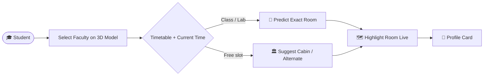

<p align="center">
  
  <a href="https://github.com/Nitinsen001"></a>
  <br>
  
  
  
  <a href="https://holopin.io/@nitinsen001"></a>
</p>

## 👨‍💻 About Me

<table>
  <tr>
    <td valign="middle">
      <ul>
        <li>🔭 Working on <b>AirAware – Smart Air Quality Prediction System</b></li>
        <li>🌱 Learning <b>Machine Learning, Data Science &amp; AI Engineering</b></li>
        <li>💬 Ask me about <b>Python, ML, Data Science, Django, Pandas, NumPy, Scikit-Learn</b></li>
        <li>🎯 Goal: build AI products that solve <b>real problems for real people</b></li>
        <li>📫 Reach me: <b>nitinsen91650@gmail.com</b></li>
      </ul>
    </td>
    <td align="center" valign="middle">
      
    </td>
  </tr>
</table>

```python
class NitinSen:
    role       = "AI & Machine Learning Engineer"
    languages  = ["Python", "C", "C++", "HTML/CSS"]
    frameworks = ["Django", "Streamlit", "Scikit-Learn"]
    data_stack = ["Pandas", "NumPy", "Jupyter", "MySQL"]
    motto      = "Turn data into decisions, and ideas into real-world products."
```

## 🌐 Connect With Me

<p align="center">
  <a href="https://www.linkedin.com/in/nitin-sen-972a7130a"></a>
  <a href="https://www.kaggle.com/nitinsen001"></a>
  <a href="https://www.codechef.com/users/nitin_sen_001"></a>
  <a href="mailto:nitinsen91650@gmail.com"></a>
</p>

## 🛠️ Tech Stack

<p align="center">
  
  
</p>

| Skill | Level | Skill | Level |
|:--|:--|:--|:--|
| 🐍 Python |  | 🌐 Django |  |
| 🤖 Machine Learning |  | 🗄️ MySQL |  |
| 📊 Pandas / NumPy |  | ⚙️ C / C++ |  |

## 🌟 Featured Project: 🧭 Campus Guide

**A real-time faculty locator with an interactive 3D campus model.**
 

> Students often waste time searching for faculty members because they don't know their real-time location. **Campus Guide** predicts a faculty member's current location using timetable data and suggests alternate locations when they're unavailable.



| Feature | Description |
|:--|:--|
| 🗺️ **Interactive 3D Campus** | Click any faculty member to view their live status |
| 👤 **Profile Cards** | Photo, Department, Designation, Cabin, Room No., Building, Floor |
| 📍 **Live Room Highlight** | Selected room is highlighted live on the 3D model |
| 🏛️ **Special Rooms** | Principal Office, HOD Office, Laboratories labeled |
| 🔮 **Smart Prediction** | Predicts current location from timetable data |
| ⏱️ **Time Saver** | Cuts unnecessary calls and improves campus navigation |

## 🗂️ Other Projects

<table>
  <tr>
    <td width="50%" valign="top">
      <b>🌫️ AirAware</b> <br>
      Smart Air Quality Prediction System — forecasts <b>7-day AQI</b> using Python &amp; Facebook Prophet, with a Streamlit dashboard and automated alerts.<br>
        
    </td>
    <td width="50%" valign="top">
      <b>🎯 AI-Powered Career Recommender</b> <br>
      Recommends career paths from <b>skills &amp; MBTI traits</b> using Django &amp; Scikit-Learn, with NLP-based resume parsing.<br>
        
    </td>
  </tr>
  <tr>
    <td width="50%" valign="top">
      <b>🛒 E-Commerce Store</b> <br>
      Full-featured store built with Django — user auth, search, cart and PayPal integration, with a responsive animated UI.<br>
        
    </td>
    <td width="50%" valign="top">
      <b>🚀 Next Project</b> <br>
      Something new is always cooking. Stay tuned! 👀
    </td>
  </tr>
</table>

## 📊 GitHub Stats

<p align="center">
  
  
  
</p>

<p align="center">
  
  
</p>

## 🐍 Contribution Snake

<p align="center">
  
</p>

<p align="center">
  <a href="mailto:nitinsen91650@gmail.com"></a>
  
  
</p>
