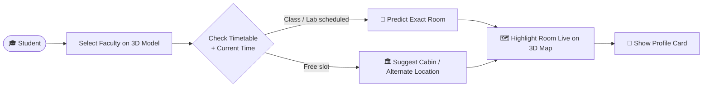
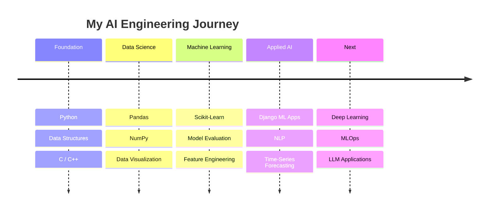

<!-- ===================== HEADER (animated waving banner) ===================== -->
<div align="center">


<a href="https://github.com/Nitinsen001">
  
</a>

<br/>


<br/><br/>

<a href="https://holopin.io/@nitinsen001">
  
</a>

</div>

---

## 👨‍💻 About Me


```python
class NitinSen:
    role      = "AI & Machine Learning Engineer"
    location  = "Rajkot, Gujarat, India 🇮🇳"
    languages = ["Python", "C", "C++", "HTML/CSS"]
    frameworks = ["Django", "Streamlit", "Scikit-Learn"]
    data_stack = ["Pandas", "NumPy", "Jupyter", "MySQL"]

    currently_building = "AirAware – Smart Air Quality Prediction System"
    currently_learning = ["Machine Learning", "Data Science", "AI Engineering"]

    def motto(self):
        return "Turn data into decisions, and ideas into real-world products."

    def ask_me_about(self):
        return ["Python", "ML", "Data Science", "Django", "Pandas", "NumPy", "Scikit-Learn"]
```

- 🔭 Currently working on **AirAware – Smart Air Quality Prediction System**
- 🌱 Currently learning **Machine Learning, Data Science & AI Engineering**
- 💬 Ask me about **Python, Machine Learning, Data Science, Django, Pandas, NumPy, Scikit-Learn**
- 🎯 Goal: build AI products that solve **real problems for real people**
- 📫 Reach me at **nitinsen91650@gmail.com**

<br clear="right"/>

---

## 🌐 Connect With Me

<p align="center">
  <a href="https://www.linkedin.com/in/nitin-sen-972a7130a"></a>
  <a href="https://www.kaggle.com/nitinsen001"></a>
  <a href="https://www.codechef.com/users/nitin_sen_001"></a>
  <a href="mailto:nitinsen91650@gmail.com"></a>
</p>

---

## 🛠️ Tech Stack

<div align="center">

**Languages & Web**


**Data Science & ML**


<a href="https://jupyter.org/"></a>

**Database & Tools**


</div>

### 📈 Skill Levels

| Skill | Level |
|:--|:--|
| 🐍 Python |  |
| 🤖 Machine Learning |  |
| 📊 Pandas / NumPy |  |
| 🌐 Django |  |
| 🗄️ MySQL |  |
| ⚙️ C / C++ |  |

> 💡 *Change the numbers in the links above to match your real skill levels.*

---

## 🌟 Featured Project

<div align="center">

### 🧭 Campus Guide
**A real-time faculty locator with an interactive 3D campus model**


</div>

> Students often waste time searching for faculty members because they don't know their real-time location — making repeated calls or asking around. **Campus Guide** solves this by predicting a faculty member's current location using timetable data, and suggesting alternate locations when they're unavailable.

### ⚙️ How It Works



### ✨ Key Features

| Feature | Description |
|:--|:--|
| 🗺️ **Interactive 3D Campus** | Click any faculty member to view their live status |
| 👤 **Profile Cards** | Photo, Department, Designation, Cabin, Room No., Building, Floor |
| 📍 **Live Room Highlight** | The selected room is highlighted on the 3D model in real time |
| 🏛️ **Special Rooms** | Principal Office, HOD Office, Laboratories clearly labeled |
| 🔮 **Smart Prediction** | Uses timetable data to predict current location |
| 🔁 **Alternate Locations** | Suggests where to find faculty when they're unavailable |
| ⏱️ **Time Saver** | Cuts unnecessary calls and improves campus navigation |

---

## 🗂️ Other Projects

<table>
  <tr>
    <td width="50%" valign="top">
      <h3>🌫️ AirAware</h3>
      <p>Smart Air Quality Prediction System — forecasts <b>7-day AQI</b> with automated alerts and an interactive dashboard.</p>
      
      
      
      <br/><br/>
      
    </td>
    <td width="50%" valign="top">
      <h3>🎯 AI-Powered Career Recommender</h3>
      <p>Recommends career paths from <b>skills &amp; MBTI traits</b>, with NLP-based resume parsing.</p>
      
      
      
      <br/><br/>
      
    </td>
  </tr>
  <tr>
    <td width="50%" valign="top">
      <h3>🛒 E-Commerce Store</h3>
      <p>Full-featured store with <b>user auth, search, cart, and PayPal integration</b>, wrapped in a responsive animated UI.</p>
      
      
      
      <br/><br/>
      
    </td>
    <td width="50%" valign="top">
      <h3>🚀 Next Project</h3>
      <p>Something new is always cooking. Stay tuned! 👀</p>
      
    </td>
  </tr>
</table>

---

## 🧠 Learning Roadmap



---

## 📊 GitHub Stats

<div align="center">


### 📈 Contribution Graph


### 🏆 Trophies


</div>

---

## 🐍 Contribution Snake

<p align="center">
  
</p>

---

## 💬 Let's Collaborate!

<div align="center">

**Open to ML / Data Science projects, internships & collaborations.**

<a href="mailto:nitinsen91650@gmail.com">
  
</a>

<br/><br/>


</div>
